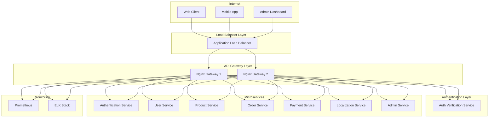

# 🎨🎨🎨 ENTERING CREATIVE PHASE: API GATEWAY ARCHITECTURE 🎨🎨🎨

**Creative Phase ID**: CREATIVE-002
**Component**: Infrastructure (System-wide)
**Type**: System Architecture
**Priority**: CRITICAL
**Status**: IN PROGRESS

## Problem Statement

The global e-commerce platform requires a robust API Gateway architecture that serves as the single entry point for all client requests, handling:
- Request routing to appropriate microservices
- Load balancing across service instances
- SSL termination and security
- Authentication and authorization
- Rate limiting and throttling
- Request/response transformation
- Monitoring and logging
- CORS handling for web clients
- WebSocket support for real-time features

**Key Challenges**:
1. High availability and fault tolerance
2. Efficient request routing to 7 backend services
3. Security policy enforcement
4. Performance optimization and caching
5. Service discovery and health checking
6. Request transformation and versioning
7. Monitoring and observability
8. Scalability for high traffic volumes

## Requirements Analysis

### Functional Requirements
- **Request Routing**: Route requests to appropriate microservices based on path patterns
- **Load Balancing**: Distribute traffic across multiple service instances
- **SSL Termination**: Handle HTTPS encryption/decryption
- **Authentication**: Validate JWT tokens and forward user context
- **CORS**: Handle cross-origin requests from web applications
- **Health Checks**: Monitor service health and route traffic accordingly
- **Request Logging**: Log all requests for monitoring and debugging

### Non-Functional Requirements
- **Performance**: Sub-100ms routing overhead
- **Availability**: 99.9% uptime with failover capabilities
- **Scalability**: Handle 10,000+ concurrent connections
- **Security**: Prevent common attacks (DDoS, injection, etc.)
- **Monitoring**: Real-time metrics and alerting
- **Maintainability**: Easy configuration and deployment

## API Gateway Architecture Options

### Option 1: Nginx as Reverse Proxy + Custom Auth
**Description**: Use Nginx as a reverse proxy with custom authentication modules

**Configuration Example**:
```nginx
# nginx.conf
upstream auth_service {
    server auth-service:5000;
    server auth-service-2:5000;
}

upstream product_service {
    server product-service:5000;
    server product-service-2:5000;
}

server {
    listen 443 ssl http2;
    server_name api.ecommerce.com;
    
    # SSL Configuration
    ssl_certificate /etc/ssl/certs/api.ecommerce.com.crt;
    ssl_certificate_key /etc/ssl/private/api.ecommerce.com.key;
    
    # Security Headers
    add_header X-Frame-Options DENY;
    add_header X-Content-Type-Options nosniff;
    add_header X-XSS-Protection "1; mode=block";
    
    # Rate Limiting
    limit_req_zone $binary_remote_addr zone=api:10m rate=100r/m;
    limit_req zone=api burst=20 nodelay;
    
    # Authentication Service
    location /api/auth/ {
        proxy_pass http://auth_service/;
        proxy_set_header Host $host;
        proxy_set_header X-Real-IP $remote_addr;
        proxy_set_header X-Forwarded-For $proxy_add_x_forwarded_for;
        proxy_set_header X-Forwarded-Proto $scheme;
    }
    
    # Product Service (requires auth)
    location /api/products/ {
        auth_request /auth-check;
        proxy_pass http://product_service/;
        proxy_set_header Host $host;
        proxy_set_header X-Real-IP $remote_addr;
        proxy_set_header X-User-ID $upstream_http_x_user_id;
    }
    
    # Internal auth check
    location = /auth-check {
        internal;
        proxy_pass http://auth_service/verify;
        proxy_pass_request_body off;
        proxy_set_header Content-Length "";
        proxy_set_header X-Original-URI $request_uri;
    }
}
```

**Pros**:
- High performance and battle-tested
- Excellent SSL/TLS support
- Built-in load balancing and health checks
- Low resource usage
- Extensive configuration options
- Strong caching capabilities

**Cons**:
- Complex authentication integration
- Limited request transformation
- Configuration complexity for advanced features
- Manual service discovery
- Basic monitoring capabilities

**Complexity**: MEDIUM
**Performance**: EXCELLENT
**Scalability**: HIGH
**Maintainability**: MEDIUM

### Option 2: Kong API Gateway
**Description**: Use Kong as a feature-rich API Gateway with plugins

**Configuration Example**:
```yaml
# kong.yml
_format_version: "3.0"

services:
- name: auth-service
  url: http://auth-service:5000
  plugins:
  - name: rate-limiting
    config:
      minute: 100
      hour: 1000

- name: product-service
  url: http://product-service:5000
  plugins:
  - name: jwt
    config:
      secret_is_base64: false
  - name: rate-limiting
    config:
      minute: 200

routes:
- name: auth-routes
  service: auth-service
  paths:
  - /api/auth

- name: product-routes
  service: product-service
  paths:
  - /api/products
  plugins:
  - name: cors
    config:
      origins:
      - "https://ecommerce.com"
      methods:
      - GET
      - POST
      - PUT
      - DELETE
```

**Pros**:
- Rich plugin ecosystem
- Built-in authentication and authorization
- Advanced rate limiting and throttling
- Service discovery integration
- Real-time monitoring and analytics
- Easy request/response transformation
- Declarative configuration

**Cons**:
- Higher resource usage
- Additional complexity
- Learning curve for configuration
- Potential vendor lock-in
- Enterprise features require license

**Complexity**: MEDIUM-HIGH
**Performance**: GOOD
**Scalability**: HIGH
**Maintainability**: HIGH

### Option 3: Custom Node.js/Express Gateway
**Description**: Build a custom API Gateway using Node.js and Express

**Implementation Example**:
```javascript
// gateway.js
const express = require('express');
const httpProxy = require('http-proxy-middleware');
const jwt = require('jsonwebtoken');
const rateLimit = require('express-rate-limit');

const app = express();

// Rate limiting
const limiter = rateLimit({
  windowMs: 15 * 60 * 1000, // 15 minutes
  max: 1000 // limit each IP to 1000 requests per windowMs
});

// JWT Authentication middleware
const authenticateToken = (req, res, next) => {
  const authHeader = req.headers['authorization'];
  const token = authHeader && authHeader.split(' ')[1];
  
  if (!token) {
    return res.sendStatus(401);
  }
  
  jwt.verify(token, process.env.JWT_SECRET, (err, user) => {
    if (err) return res.sendStatus(403);
    req.user = user;
    next();
  });
};

// Service routes
app.use('/api/auth', limiter, httpProxy({
  target: 'http://auth-service:5000',
  changeOrigin: true,
  pathRewrite: { '^/api/auth': '' }
}));

app.use('/api/products', limiter, authenticateToken, httpProxy({
  target: 'http://product-service:5000',
  changeOrigin: true,
  pathRewrite: { '^/api/products': '' },
  onProxyReq: (proxyReq, req, res) => {
    proxyReq.setHeader('X-User-ID', req.user.id);
  }
}));

app.listen(3000);
```

**Pros**:
- Full control over functionality
- JavaScript ecosystem integration
- Easy to customize and extend
- Good TypeScript support
- Familiar technology stack

**Cons**:
- Development and maintenance overhead
- Performance concerns for high traffic
- Need to implement all features from scratch
- Potential security vulnerabilities
- Scaling complexity

**Complexity**: HIGH
**Performance**: MEDIUM
**Scalability**: MEDIUM
**Maintainability**: LOW

## 🎨 CREATIVE CHECKPOINT: API Gateway Decision

**Recommended Approach**: **Option 1 - Nginx as Reverse Proxy + Custom Auth**

**Rationale**:
1. **Performance**: Nginx provides excellent performance for high-traffic scenarios
2. **Reliability**: Battle-tested in production environments
3. **Simplicity**: Less complexity than full-featured gateways
4. **Cost**: No licensing costs
5. **Resource Efficiency**: Low memory and CPU usage
6. **SSL/TLS**: Excellent SSL/TLS performance and configuration options
7. **Evolution Path**: Can migrate to Kong or custom solution later if needed

**Risk Mitigation**:
- Use Nginx Plus for advanced features if needed
- Implement custom authentication service for JWT validation
- Use external monitoring tools (Prometheus, Grafana)
- Implement proper error handling and fallback mechanisms

## Detailed API Gateway Architecture

### 1. Overall Architecture



### 2. Complete Nginx Configuration

```nginx
# /etc/nginx/nginx.conf
user nginx;
worker_processes auto;
error_log /var/log/nginx/error.log warn;
pid /var/run/nginx.pid;

# Optimize for high performance
worker_rlimit_nofile 65535;

events {
    worker_connections 4096;
    use epoll;
    multi_accept on;
}

http {
    include /etc/nginx/mime.types;
    default_type application/octet-stream;
    
    # Logging format
    log_format main '$remote_addr - $remote_user [$time_local] "$request" '
                    '$status $body_bytes_sent "$http_referer" '
                    '"$http_user_agent" "$http_x_forwarded_for" '
                    'rt=$request_time uct="$upstream_connect_time" '
                    'uht="$upstream_header_time" urt="$upstream_response_time"';
    
    access_log /var/log/nginx/access.log main;
    
    # Performance optimizations
    sendfile on;
    tcp_nopush on;
    tcp_nodelay on;
    keepalive_timeout 65;
    types_hash_max_size 2048;
    client_max_body_size 10M;
    
    # Gzip compression
    gzip on;
    gzip_vary on;
    gzip_min_length 1024;
    gzip_proxied any;
    gzip_comp_level 6;
    gzip_types
        text/plain
        text/css
        text/xml
        text/javascript
        application/json
        application/javascript
        application/xml+rss
        application/atom+xml
        image/svg+xml;
    
    # Rate limiting zones
    limit_req_zone $binary_remote_addr zone=auth:10m rate=10r/m;
    limit_req_zone $binary_remote_addr zone=api:10m rate=100r/m;
    limit_req_zone $binary_remote_addr zone=public:10m rate=200r/m;
    
    # Connection limiting
    limit_conn_zone $binary_remote_addr zone=conn_limit_per_ip:10m;
    
    # Upstream service definitions
    upstream auth_service {
        least_conn;
        server auth-service-1:5000 max_fails=3 fail_timeout=30s;
        server auth-service-2:5000 max_fails=3 fail_timeout=30s;
        keepalive 32;
    }
    
    upstream user_service {
        least_conn;
        server user-service-1:5000 max_fails=3 fail_timeout=30s;
        server user-service-2:5000 max_fails=3 fail_timeout=30s;
        keepalive 32;
    }
    
    upstream product_service {
        least_conn;
        server product-service-1:5000 max_fails=3 fail_timeout=30s;
        server product-service-2:5000 max_fails=3 fail_timeout=30s;
        keepalive 32;
    }
    
    upstream order_service {
        least_conn;
        server order-service-1:5000 max_fails=3 fail_timeout=30s;
        server order-service-2:5000 max_fails=3 fail_timeout=30s;
        keepalive 32;
    }
    
    upstream payment_service {
        least_conn;
        server payment-service-1:5000 max_fails=3 fail_timeout=30s;
        server payment-service-2:5000 max_fails=3 fail_timeout=30s;
        keepalive 32;
    }
    
    upstream localization_service {
        least_conn;
        server localization-service-1:5000 max_fails=3 fail_timeout=30s;
        server localization-service-2:5000 max_fails=3 fail_timeout=30s;
        keepalive 32;
    }
    
    upstream admin_service {
        least_conn;
        server admin-service-1:5000 max_fails=3 fail_timeout=30s;
        server admin-service-2:5000 max_fails=3 fail_timeout=30s;
        keepalive 32;
    }
    
    # Auth verification service
    upstream auth_check_service {
        server auth-service-1:5000;
        server auth-service-2:5000;
        keepalive 16;
    }
    
    # Main server configuration
    server {
        listen 80;
        server_name api.ecommerce.com;
        return 301 https://$server_name$request_uri;
    }
    
    server {
        listen 443 ssl http2;
        server_name api.ecommerce.com;
        
        # SSL Configuration
        ssl_certificate /etc/ssl/certs/api.ecommerce.com.crt;
        ssl_certificate_key /etc/ssl/private/api.ecommerce.com.key;
        ssl_protocols TLSv1.2 TLSv1.3;
        ssl_ciphers ECDHE-RSA-AES128-GCM-SHA256:ECDHE-RSA-AES256-GCM-SHA384;
        ssl_prefer_server_ciphers off;
        ssl_session_cache shared:SSL:10m;
        ssl_session_timeout 10m;
        
        # Security Headers
        add_header X-Frame-Options DENY always;
        add_header X-Content-Type-Options nosniff always;
        add_header X-XSS-Protection "1; mode=block" always;
        add_header Referrer-Policy "strict-origin-when-cross-origin" always;
        add_header Content-Security-Policy "default-src 'self'" always;
        
        # Connection limits
        limit_conn conn_limit_per_ip 50;
        
        # Health check endpoint
        location /health {
            access_log off;
            return 200 "healthy\n";
            add_header Content-Type text/plain;
        }
        
        # Authentication service (public endpoints)
        location /api/auth/register {
            limit_req zone=auth burst=5 nodelay;
            proxy_pass http://auth_service/register;
            include /etc/nginx/proxy_params;
        }
        
        location /api/auth/login {
            limit_req zone=auth burst=5 nodelay;
            proxy_pass http://auth_service/login;
            include /etc/nginx/proxy_params;
        }
        
        location /api/auth/refresh {
            limit_req zone=auth burst=10 nodelay;
            proxy_pass http://auth_service/refresh;
            include /etc/nginx/proxy_params;
        }
        
        location /api/auth/forgot-password {
            limit_req zone=auth burst=3 nodelay;
            proxy_pass http://auth_service/forgot-password;
            include /etc/nginx/proxy_params;
        }
        
        # User service (protected endpoints)
        location /api/users {
            limit_req zone=api burst=20 nodelay;
            auth_request /auth-check;
            proxy_pass http://user_service;
            include /etc/nginx/proxy_params;
            include /etc/nginx/auth_params;
        }
        
        # Product service (mixed public/protected)
        location /api/products {
            limit_req zone=public burst=50 nodelay;
            
            # Public read access
            if ($request_method = GET) {
                proxy_pass http://product_service;
                include /etc/nginx/proxy_params;
            }
            
            # Protected write access
            auth_request /auth-check;
            proxy_pass http://product_service;
            include /etc/nginx/proxy_params;
            include /etc/nginx/auth_params;
        }
        
        # Order service (protected)
        location /api/orders {
            limit_req zone=api burst=30 nodelay;
            auth_request /auth-check;
            proxy_pass http://order_service;
            include /etc/nginx/proxy_params;
            include /etc/nginx/auth_params;
        }
        
        location /api/cart {
            limit_req zone=api burst=50 nodelay;
            auth_request /auth-check;
            proxy_pass http://order_service;
            include /etc/nginx/proxy_params;
            include /etc/nginx/auth_params;
        }
        
        # Payment service (protected)
        location /api/payments {
            limit_req zone=api burst=10 nodelay;
            auth_request /auth-check;
            proxy_pass http://payment_service;
            include /etc/nginx/proxy_params;
            include /etc/nginx/auth_params;
        }
        
        # Payment webhooks (special handling)
        location /api/payments/webhook {
            limit_req zone=api burst=100 nodelay;
            proxy_pass http://payment_service/webhook;
            include /etc/nginx/proxy_params;
            # No auth required for webhooks
        }
        
        # Localization service (public)
        location /api/localization {
            limit_req zone=public burst=100 nodelay;
            proxy_pass http://localization_service;
            include /etc/nginx/proxy_params;
        }
        
        # Admin service (admin-only)
        location /api/admin {
            limit_req zone=api burst=10 nodelay;
            auth_request /admin-auth-check;
            proxy_pass http://admin_service;
            include /etc/nginx/proxy_params;
            include /etc/nginx/auth_params;
        }
        
        # Internal auth check endpoint
        location = /auth-check {
            internal;
            proxy_pass http://auth_check_service/verify;
            proxy_pass_request_body off;
            proxy_set_header Content-Length "";
            proxy_set_header X-Original-URI $request_uri;
            proxy_set_header X-Original-Method $request_method;
            proxy_set_header Authorization $http_authorization;
        }
        
        # Internal admin auth check endpoint
        location = /admin-auth-check {
            internal;
            proxy_pass http://auth_check_service/verify-admin;
            proxy_pass_request_body off;
            proxy_set_header Content-Length "";
            proxy_set_header X-Original-URI $request_uri;
            proxy_set_header X-Original-Method $request_method;
            proxy_set_header Authorization $http_authorization;
        }
        
        # CORS preflight handling
        location ~* ^/api/.* {
            if ($request_method = 'OPTIONS') {
                add_header 'Access-Control-Allow-Origin' 'https://ecommerce.com' always;
                add_header 'Access-Control-Allow-Methods' 'GET, POST, PUT, DELETE, OPTIONS' always;
                add_header 'Access-Control-Allow-Headers' 'Authorization, Content-Type, Accept, Origin, X-Requested-With' always;
                add_header 'Access-Control-Max-Age' 1728000 always;
                add_header 'Content-Type' 'text/plain; charset=utf-8' always;
                add_header 'Content-Length' 0 always;
                return 204;
            }
        }
        
        # Default error pages
        error_page 404 /404.html;
        error_page 500 502 503 504 /50x.html;
        
        location = /404.html {
            root /usr/share/nginx/html;
        }
        
        location = /50x.html {
            root /usr/share/nginx/html;
        }
    }
}
```

### 3. Nginx Configuration Files

```nginx
# /etc/nginx/proxy_params
proxy_set_header Host $http_host;
proxy_set_header X-Real-IP $remote_addr;
proxy_set_header X-Forwarded-For $proxy_add_x_forwarded_for;
proxy_set_header X-Forwarded-Proto $scheme;
proxy_set_header X-Forwarded-Host $host;
proxy_set_header X-Forwarded-Port $server_port;

# Connection settings
proxy_connect_timeout 60s;
proxy_send_timeout 60s;
proxy_read_timeout 60s;
proxy_buffering on;
proxy_buffer_size 4k;
proxy_buffers 8 4k;
proxy_busy_buffers_size 8k;

# HTTP version
proxy_http_version 1.1;
proxy_set_header Connection "";
```

```nginx
# /etc/nginx/auth_params
# Pass authenticated user information
proxy_set_header X-User-ID $upstream_http_x_user_id;
proxy_set_header X-User-Email $upstream_http_x_user_email;
proxy_set_header X-User-Roles $upstream_http_x_user_roles;
```

### 4. Authentication Service Integration

The authentication service needs to provide verification endpoints:

```python
# auth_service/verify.py
from flask import Flask, request, jsonify
import jwt
import os

app = Flask(__name__)

@app.route('/verify', methods=['GET'])
def verify_token():
    """Verify JWT token for Nginx auth_request"""
    auth_header = request.headers.get('Authorization')
    
    if not auth_header or not auth_header.startswith('Bearer '):
        return '', 401
    
    token = auth_header.split(' ')[1]
    
    try:
        payload = jwt.decode(token, os.getenv('JWT_SECRET'), algorithms=['HS256'])
        
        # Return user information in headers
        response = jsonify({'status': 'valid'})
        response.headers['X-User-ID'] = payload.get('user_id')
        response.headers['X-User-Email'] = payload.get('email')
        response.headers['X-User-Roles'] = ','.join(payload.get('roles', []))
        
        return response, 200
        
    except jwt.ExpiredSignatureError:
        return '', 401
    except jwt.InvalidTokenError:
        return '', 403

@app.route('/verify-admin', methods=['GET'])
def verify_admin_token():
    """Verify JWT token has admin role"""
    auth_header = request.headers.get('Authorization')
    
    if not auth_header or not auth_header.startswith('Bearer '):
        return '', 401
    
    token = auth_header.split(' ')[1]
    
    try:
        payload = jwt.decode(token, os.getenv('JWT_SECRET'), algorithms=['HS256'])
        roles = payload.get('roles', [])
        
        if 'admin' not in roles and 'super_admin' not in roles:
            return '', 403
        
        # Return user information in headers
        response = jsonify({'status': 'valid'})
        response.headers['X-User-ID'] = payload.get('user_id')
        response.headers['X-User-Email'] = payload.get('email')
        response.headers['X-User-Roles'] = ','.join(roles)
        
        return response, 200
        
    except jwt.ExpiredSignatureError:
        return '', 401
    except jwt.InvalidTokenError:
        return '', 403
```

### 5. Docker Configuration

```dockerfile
# Dockerfile for Nginx Gateway
FROM nginx:alpine

# Install additional modules if needed
RUN apk add --no-cache nginx-mod-http-headers-more

# Copy configuration files
COPY nginx.conf /etc/nginx/nginx.conf
COPY proxy_params /etc/nginx/proxy_params
COPY auth_params /etc/nginx/auth_params

# Copy SSL certificates (in production, use proper certificate management)
COPY ssl/api.ecommerce.com.crt /etc/ssl/certs/
COPY ssl/api.ecommerce.com.key /etc/ssl/private/

# Set proper permissions
RUN chmod 600 /etc/ssl/private/api.ecommerce.com.key

# Health check
HEALTHCHECK --interval=30s --timeout=3s --start-period=5s --retries=3 \
    CMD curl -f https://localhost/health || exit 1

EXPOSE 80 443

CMD ["nginx", "-g", "daemon off;"]
```

```yaml
# docker-compose.yml excerpt
version: '3.8'

services:
  nginx-gateway-1:
    build: ./nginx-gateway
    ports:
      - "80:80"
      - "443:443"
    depends_on:
      - auth-service-1
      - auth-service-2
      - user-service-1
      - user-service-2
      - product-service-1
      - product-service-2
    volumes:
      - ./logs/nginx:/var/log/nginx
    networks:
      - ecommerce-network
    deploy:
      resources:
        limits:
          memory: 512M
        reservations:
          memory: 256M

  nginx-gateway-2:
    build: ./nginx-gateway
    depends_on:
      - auth-service-1
      - auth-service-2
      - user-service-1
      - user-service-2
      - product-service-1
      - product-service-2
    volumes:
      - ./logs/nginx:/var/log/nginx
    networks:
      - ecommerce-network
    deploy:
      resources:
        limits:
          memory: 512M
        reservations:
          memory: 256M
```

### 6. Monitoring and Observability

```nginx
# Add to nginx.conf for Prometheus metrics
location /metrics {
    access_log off;
    allow 10.0.0.0/8;
    allow 172.16.0.0/12;
    allow 192.168.0.0/16;
    deny all;
    
    content_by_lua_block {
        local prometheus = require "resty.prometheus"
        prometheus:collect()
    }
}
```

```yaml
# prometheus.yml
global:
  scrape_interval: 15s

scrape_configs:
  - job_name: 'nginx-gateway'
    static_configs:
      - targets: ['nginx-gateway-1:80', 'nginx-gateway-2:80']
    metrics_path: /metrics
    scrape_interval: 10s
```

## Implementation Guidelines

### 1. Deployment Strategy
- Deploy Nginx gateways behind Application Load Balancer
- Use auto-scaling groups for high availability
- Implement blue-green deployment for zero-downtime updates
- Configure health checks and automatic failover

### 2. Security Measures
- Implement Web Application Firewall (WAF) rules
- Use rate limiting to prevent abuse
- Set up DDoS protection at load balancer level
- Regular security audits and penetration testing
- Implement proper SSL/TLS configuration

### 3. Performance Optimization
- Enable HTTP/2 for improved performance
- Implement caching strategies for static content
- Use connection pooling for upstream services
- Monitor and optimize upstream timeouts
- Implement compression for reduced bandwidth

### 4. Monitoring and Alerting
- Set up Prometheus metrics collection
- Create Grafana dashboards for visualization
- Implement alerting for high error rates
- Monitor upstream service health
- Track performance metrics and SLAs

## Verification Against Requirements

✅ **Requirements Met**:
- [x] Request routing to appropriate microservices
- [x] Load balancing across service instances
- [x] SSL termination and security
- [x] Authentication and authorization
- [x] Rate limiting and throttling
- [x] CORS handling for web clients
- [x] Monitoring and logging
- [x] High availability and fault tolerance
- [x] Performance optimization
- [x] Scalability for high traffic

✅ **Technical Feasibility**: HIGH - Nginx is proven for high-traffic scenarios
✅ **Risk Assessment**: LOW - Well-established technology with extensive documentation

🎨🎨🎨 EXITING CREATIVE PHASE - API GATEWAY ARCHITECTURE COMPLETE 🎨🎨🎨

**Decision**: Nginx-based API Gateway with custom authentication integration
**Implementation**: Complete configuration with security, performance, and monitoring
**Next Steps**: Update tasks.md and proceed to Frontend UI/UX Design creative phase
