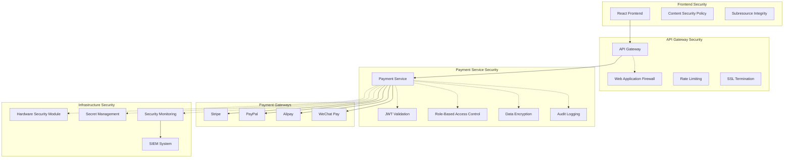
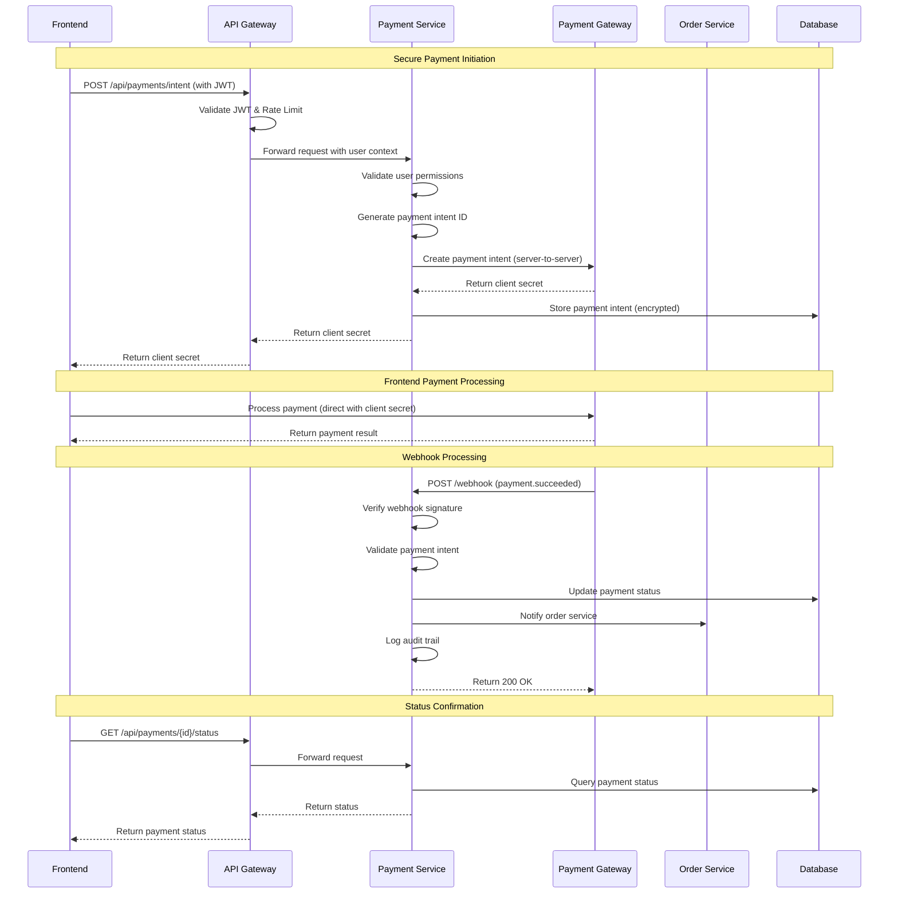

# 🎨🎨🎨 ENTERING CREATIVE PHASE: PAYMENT SECURITY ARCHITECTURE 🎨🎨🎨

**Creative Phase ID**: CREATIVE-004
**Component**: Payment Service
**Type**: Security Architecture
**Priority**: CRITICAL
**Status**: IN PROGRESS

## Problem Statement

The global e-commerce platform requires a robust and secure payment processing architecture that handles:
- Multiple payment gateways (Stripe, PayPal, Alipay, WeChat Pay)
- PCI DSS compliance and security standards
- Secure token-based payment flows
- Webhook processing for real-time updates
- Fraud detection and prevention
- Multi-currency transaction processing
- Refund and chargeback handling
- Strong encryption and data protection
- Audit logging and compliance reporting
- Scalable architecture for high transaction volumes

**Key Security Challenges**:
1. PCI DSS compliance without storing card data
2. Secure communication between services
3. Token-based payment processing
4. Webhook verification and processing
5. Fraud detection and prevention
6. Secure key management
7. Encryption of sensitive data
8. Audit trails and compliance
9. Preventing payment replay attacks
10. Handling payment gateway failures securely

## Requirements Analysis

### Security Requirements
- **PCI DSS Compliance**: Level 1 compliance for payment card processing
- **Data Protection**: No storage of sensitive payment data
- **Encryption**: End-to-end encryption for all payment communications
- **Authentication**: Strong authentication for all payment operations
- **Authorization**: Role-based access control for payment functions
- **Audit Logging**: Comprehensive audit trails for all transactions
- **Fraud Prevention**: Real-time fraud detection and prevention
- **Compliance**: SOX, GDPR, and regional payment regulations

### Functional Requirements
- **Multi-Gateway Support**: Integrate with multiple payment providers
- **Token Processing**: Secure tokenization of payment methods
- **Real-time Processing**: Immediate payment authorization and capture
- **Webhook Handling**: Secure processing of gateway webhooks
- **Refund Processing**: Secure refund and partial refund capabilities
- **Currency Support**: Multi-currency transaction processing
- **Failure Handling**: Graceful handling of payment failures
- **Reporting**: Transaction reporting and analytics

### Non-Functional Requirements
- **Performance**: Sub-second payment processing
- **Availability**: 99.99% uptime for payment services
- **Scalability**: Handle 10,000+ transactions per minute
- **Reliability**: Zero data loss for payment transactions
- **Monitoring**: Real-time monitoring and alerting
- **Recovery**: Disaster recovery and business continuity

## Payment Security Architecture Options

### Option 1: Gateway-as-a-Service (Recommended)
**Description**: Use payment gateways' hosted services with tokenization

**Architecture Flow**:
```
Frontend → Payment Gateway (Direct) → Webhook → Payment Service → Order Service
```

**Security Model**:
- Frontend communicates directly with payment gateways
- Payment service never handles raw card data
- Tokens used for all payment operations
- Webhooks provide transaction updates

**Pros**:
- Minimal PCI DSS scope (SAQ-A)
- No sensitive data storage
- Reduced security risk
- Lower compliance burden
- Gateway-managed security
- Faster implementation

**Cons**:
- Dependency on gateway uptime
- Limited customization
- Potential vendor lock-in
- Frontend complexity for multiple gateways
- Network latency for direct calls

**PCI DSS Scope**: SAQ-A (minimal)
**Security Level**: EXCELLENT
**Implementation Complexity**: LOW
**Compliance Burden**: LOW

### Option 2: Tokenization Service Architecture
**Description**: Central tokenization service with secure token vault

**Architecture Flow**:
```
Frontend → Tokenization Service → Payment Vault → Payment Service → Gateways
```

**Security Model**:
- Dedicated tokenization service
- Secure token vault with encryption
- Payment service uses tokens only
- HSM (Hardware Security Module) for key management

**Pros**:
- Centralized token management
- Enhanced security controls
- Consistent token format
- Advanced fraud detection
- Better audit capabilities
- Gateway independence

**Cons**:
- Higher PCI DSS scope (SAQ-D)
- Complex implementation
- Higher infrastructure costs
- Additional security requirements
- Performance overhead

**PCI DSS Scope**: SAQ-D (full)
**Security Level**: EXCELLENT
**Implementation Complexity**: HIGH
**Compliance Burden**: HIGH

### Option 3: Hybrid Gateway Architecture
**Description**: Combination of direct gateway integration and centralized orchestration

**Architecture Flow**:
```
Frontend → Payment Orchestrator → Multiple Gateways (Parallel) → Webhook Aggregator
```

**Security Model**:
- Payment orchestrator manages gateway selection
- Direct tokenization with each gateway
- Centralized webhook processing
- Failover and retry mechanisms

**Pros**:
- Gateway redundancy
- Intelligent routing
- Optimized for different regions
- Balanced security approach
- Good performance
- Flexibility in gateway choice

**Cons**:
- Moderate PCI DSS scope
- Complex orchestration logic
- Multiple gateway management
- Testing complexity
- Monitoring complexity

**PCI DSS Scope**: SAQ-A-EP (moderate)
**Security Level**: HIGH
**Implementation Complexity**: MEDIUM-HIGH
**Compliance Burden**: MEDIUM

## 🎨 CREATIVE CHECKPOINT: Payment Security Decision

**Recommended Approach**: **Option 1 - Gateway-as-a-Service with Enhanced Security**

**Rationale**:
1. **Security**: Minimal PCI DSS scope reduces security risk
2. **Compliance**: Lower compliance burden and costs
3. **Implementation Speed**: Faster time to market
4. **Reliability**: Leverages gateway security expertise
5. **Scalability**: Gateways handle scaling and availability
6. **Cost**: Lower infrastructure and compliance costs
7. **Evolution Path**: Can evolve to Option 3 as volume grows

**Enhanced Security Measures**:
- Comprehensive webhook verification
- Strong encryption for all communications
- Detailed audit logging
- Real-time fraud monitoring
- Secure key management
- Regular security assessments

## Detailed Payment Security Architecture

### 1. Overall Security Architecture



### 2. Secure Payment Flow Design



### 3. Payment Service Security Implementation

```python
# payment_service/security.py
import hmac
import hashlib
import json
import os
from functools import wraps
from flask import request, jsonify, current_app
from cryptography.fernet import Fernet
import jwt

class PaymentSecurity:
    def __init__(self):
        self.webhook_secrets = {
            'stripe': os.getenv('STRIPE_WEBHOOK_SECRET'),
            'paypal': os.getenv('PAYPAL_WEBHOOK_SECRET'),
            'alipay': os.getenv('ALIPAY_WEBHOOK_SECRET'),
            'wechat': os.getenv('WECHAT_WEBHOOK_SECRET')
        }
        self.encryption_key = os.getenv('PAYMENT_ENCRYPTION_KEY').encode()
        self.cipher = Fernet(self.encryption_key)
    
    def verify_webhook_signature(self, gateway, payload, signature):
        """Verify webhook signature from payment gateway"""
        if gateway == 'stripe':
            return self._verify_stripe_signature(payload, signature)
        elif gateway == 'paypal':
            return self._verify_paypal_signature(payload, signature)
        elif gateway == 'alipay':
            return self._verify_alipay_signature(payload, signature)
        elif gateway == 'wechat':
            return self._verify_wechat_signature(payload, signature)
        else:
            return False
    
    def _verify_stripe_signature(self, payload, sig_header):
        """Verify Stripe webhook signature"""
        try:
            elements = sig_header.split(',')
            timestamp = elements[0].split('=')[1]
            signatures = [elem.split('=')[1] for elem in elements[1:]]
            
            signed_payload = f"{timestamp}.{payload}"
            expected_sig = hmac.new(
                self.webhook_secrets['stripe'].encode(),
                signed_payload.encode(),
                hashlib.sha256
            ).hexdigest()
            
            return any(hmac.compare_digest(expected_sig, sig) for sig in signatures)
        except Exception:
            return False
    
    def _verify_paypal_signature(self, payload, signature):
        """Verify PayPal webhook signature"""
        # PayPal IPN verification logic
        # This would include certificate validation
        pass
    
    def encrypt_sensitive_data(self, data):
        """Encrypt sensitive payment data"""
        if isinstance(data, dict):
            data = json.dumps(data)
        return self.cipher.encrypt(data.encode()).decode()
    
    def decrypt_sensitive_data(self, encrypted_data):
        """Decrypt sensitive payment data"""
        decrypted = self.cipher.decrypt(encrypted_data.encode())
        return json.loads(decrypted.decode())
    
    def validate_payment_amount(self, amount, currency):
        """Validate payment amount for security"""
        # Implement amount validation logic
        if amount <= 0:
            return False
        
        # Check maximum limits by currency
        max_limits = {
            'USD': 50000,  # $50,000
            'EUR': 45000,  # €45,000
            'CNY': 320000, # ¥320,000
        }
        
        return amount <= max_limits.get(currency, 10000)

# Security decorators
def require_payment_admin(f):
    """Require admin role for payment operations"""
    @wraps(f)
    def decorated_function(*args, **kwargs):
        auth_header = request.headers.get('Authorization')
        if not auth_header:
            return jsonify({'error': 'Missing authorization'}), 401
        
        try:
            token = auth_header.split(' ')[1]
            payload = jwt.decode(token, os.getenv('JWT_SECRET'), algorithms=['HS256'])
            roles = payload.get('roles', [])
            
            if 'payment_admin' not in roles and 'super_admin' not in roles:
                return jsonify({'error': 'Insufficient permissions'}), 403
                
        except jwt.InvalidTokenError:
            return jsonify({'error': 'Invalid token'}), 401
        
        return f(*args, **kwargs)
    return decorated_function

def verify_webhook_source(gateway):
    """Verify webhook comes from legitimate gateway"""
    def decorator(f):
        @wraps(f)
        def decorated_function(*args, **kwargs):
            security = PaymentSecurity()
            
            if gateway == 'stripe':
                signature = request.headers.get('Stripe-Signature')
            elif gateway == 'paypal':
                signature = request.headers.get('PAYPAL-TRANSMISSION-SIG')
            else:
                signature = request.headers.get('Signature')
            
            if not signature:
                return jsonify({'error': 'Missing signature'}), 400
            
            payload = request.get_data(as_text=True)
            if not security.verify_webhook_signature(gateway, payload, signature):
                return jsonify({'error': 'Invalid signature'}), 400
            
            return f(*args, **kwargs)
        return decorated_function
    return decorator

# Audit logging
class PaymentAuditLogger:
    def __init__(self):
        self.logger = current_app.logger
    
    def log_payment_event(self, event_type, user_id, payment_id, details, ip_address):
        """Log payment-related events for audit"""
        audit_entry = {
            'timestamp': datetime.utcnow().isoformat(),
            'event_type': event_type,
            'user_id': user_id,
            'payment_id': payment_id,
            'details': details,
            'ip_address': ip_address,
            'user_agent': request.headers.get('User-Agent'),
            'session_id': request.headers.get('X-Session-ID')
        }
        
        # Log to secure audit system
        self.logger.info(f"PAYMENT_AUDIT: {json.dumps(audit_entry)}")
        
        # Also store in audit database
        self._store_audit_record(audit_entry)
    
    def _store_audit_record(self, audit_entry):
        """Store audit record in database"""
        # Implementation for database storage
        pass
```

### 4. Gateway Integration Security

```python
# payment_service/gateways/stripe_gateway.py
import stripe
import os
from ..security import PaymentSecurity, PaymentAuditLogger

class StripeGateway:
    def __init__(self):
        stripe.api_key = os.getenv('STRIPE_SECRET_KEY')
        self.security = PaymentSecurity()
        self.audit_logger = PaymentAuditLogger()
    
    def create_payment_intent(self, amount, currency, customer_id, metadata):
        """Create Stripe payment intent"""
        try:
            # Validate amount
            if not self.security.validate_payment_amount(amount, currency):
                raise ValueError("Invalid payment amount")
            
            # Create payment intent
            intent = stripe.PaymentIntent.create(
                amount=int(amount * 100),  # Convert to cents
                currency=currency.lower(),
                customer=customer_id,
                metadata=metadata,
                capture_method='automatic',
                confirmation_method='manual',
                confirm=False
            )
            
            # Encrypt and store payment intent details
            encrypted_details = self.security.encrypt_sensitive_data({
                'stripe_intent_id': intent.id,
                'amount': amount,
                'currency': currency,
                'status': intent.status
            })
            
            # Log audit event
            self.audit_logger.log_payment_event(
                'payment_intent_created',
                customer_id,
                intent.id,
                {'amount': amount, 'currency': currency},
                request.remote_addr
            )
            
            return {
                'intent_id': intent.id,
                'client_secret': intent.client_secret,
                'status': intent.status
            }
            
        except stripe.error.StripeError as e:
            self.audit_logger.log_payment_event(
                'payment_intent_error',
                customer_id,
                None,
                {'error': str(e)},
                request.remote_addr
            )
            raise
    
    def handle_webhook(self, payload, sig_header):
        """Handle Stripe webhook securely"""
        try:
            # Verify webhook signature
            if not self.security.verify_webhook_signature('stripe', payload, sig_header):
                raise ValueError("Invalid webhook signature")
            
            event = json.loads(payload)
            
            # Handle different event types
            if event['type'] == 'payment_intent.succeeded':
                self._handle_payment_success(event['data']['object'])
            elif event['type'] == 'payment_intent.payment_failed':
                self._handle_payment_failure(event['data']['object'])
            elif event['type'] == 'charge.dispute.created':
                self._handle_chargeback(event['data']['object'])
            
            return {'status': 'success'}
            
        except Exception as e:
            self.audit_logger.log_payment_event(
                'webhook_error',
                None,
                None,
                {'error': str(e), 'event_type': event.get('type')},
                request.remote_addr
            )
            raise
    
    def _handle_payment_success(self, payment_intent):
        """Handle successful payment"""
        # Update payment status in database
        # Notify order service
        # Send confirmation email
        self.audit_logger.log_payment_event(
            'payment_succeeded',
            payment_intent.get('customer'),
            payment_intent['id'],
            {
                'amount': payment_intent['amount'] / 100,
                'currency': payment_intent['currency']
            },
            'webhook'
        )
```

### 5. Fraud Detection and Prevention

```python
# payment_service/fraud_detection.py
import requests
import json
from datetime import datetime, timedelta

class FraudDetectionService:
    def __init__(self):
        self.rules = self._load_fraud_rules()
        self.risk_scores = {}
    
    def assess_payment_risk(self, payment_data, user_data, request_data):
        """Assess fraud risk for payment"""
        risk_score = 0
        risk_factors = []
        
        # Amount-based risk
        if payment_data['amount'] > 1000:
            risk_score += 20
            risk_factors.append('high_amount')
        
        # Velocity checks
        recent_payments = self._get_recent_payments(user_data['user_id'])
        if len(recent_payments) > 5:
            risk_score += 30
            risk_factors.append('high_velocity')
        
        # Geolocation checks
        if self._is_suspicious_location(request_data['ip_address'], user_data):
            risk_score += 25
            risk_factors.append('suspicious_location')
        
        # Device fingerprinting
        if self._is_new_device(request_data['device_fingerprint'], user_data['user_id']):
            risk_score += 15
            risk_factors.append('new_device')
        
        # Time-based checks
        if self._is_unusual_time(user_data['timezone']):
            risk_score += 10
            risk_factors.append('unusual_time')
        
        return {
            'risk_score': risk_score,
            'risk_level': self._get_risk_level(risk_score),
            'risk_factors': risk_factors,
            'action': self._get_recommended_action(risk_score)
        }
    
    def _get_risk_level(self, score):
        """Get risk level based on score"""
        if score < 20:
            return 'LOW'
        elif score < 50:
            return 'MEDIUM'
        elif score < 80:
            return 'HIGH'
        else:
            return 'CRITICAL'
    
    def _get_recommended_action(self, score):
        """Get recommended action based on risk score"""
        if score < 20:
            return 'APPROVE'
        elif score < 50:
            return 'REVIEW'
        elif score < 80:
            return 'CHALLENGE'  # Require additional verification
        else:
            return 'BLOCK'
```

### 6. Secure Configuration Management

```python
# payment_service/config.py
import os
from cryptography.fernet import Fernet

class SecureConfig:
    """Secure configuration management for payment service"""
    
    def __init__(self):
        self.config_encryption_key = os.getenv('CONFIG_ENCRYPTION_KEY')
        self.cipher = Fernet(self.config_encryption_key.encode())
    
    # Payment Gateway Configurations
    STRIPE_CONFIG = {
        'publishable_key': os.getenv('STRIPE_PUBLISHABLE_KEY'),
        'secret_key': os.getenv('STRIPE_SECRET_KEY'),
        'webhook_secret': os.getenv('STRIPE_WEBHOOK_SECRET'),
        'api_version': '2023-10-16'
    }
    
    PAYPAL_CONFIG = {
        'client_id': os.getenv('PAYPAL_CLIENT_ID'),
        'client_secret': os.getenv('PAYPAL_CLIENT_SECRET'),
        'webhook_id': os.getenv('PAYPAL_WEBHOOK_ID'),
        'environment': os.getenv('PAYPAL_ENVIRONMENT', 'sandbox')
    }
    
    # Security Configuration
    SECURITY_CONFIG = {
        'jwt_secret': os.getenv('JWT_SECRET'),
        'encryption_key': os.getenv('PAYMENT_ENCRYPTION_KEY'),
        'session_timeout': 3600,  # 1 hour
        'max_login_attempts': 3,
        'password_min_length': 12
    }
    
    # PCI DSS Configuration
    PCI_CONFIG = {
        'log_retention_days': 365,
        'encryption_algorithm': 'AES-256',
        'key_rotation_days': 90,
        'audit_log_encryption': True,
        'secure_deletion': True
    }
    
    # Rate Limiting Configuration
    RATE_LIMIT_CONFIG = {
        'payment_requests_per_minute': 10,
        'webhook_requests_per_minute': 1000,
        'admin_requests_per_minute': 50,
        'burst_allowance': 20
    }
    
    def get_encrypted_config(self, config_name):
        """Get encrypted configuration value"""
        encrypted_value = os.getenv(f'{config_name}_ENCRYPTED')
        if encrypted_value:
            return self.cipher.decrypt(encrypted_value.encode()).decode()
        return None
    
    def validate_configuration(self):
        """Validate all security configurations"""
        required_configs = [
            'STRIPE_SECRET_KEY',
            'JWT_SECRET',
            'PAYMENT_ENCRYPTION_KEY',
            'DATABASE_URL'
        ]
        
        missing_configs = []
        for config in required_configs:
            if not os.getenv(config):
                missing_configs.append(config)
        
        if missing_configs:
            raise ValueError(f"Missing required configurations: {missing_configs}")
        
        return True
```

### 7. Security Monitoring and Alerting

```python
# payment_service/monitoring.py
import requests
import json
from datetime import datetime

class PaymentSecurityMonitor:
    def __init__(self):
        self.alert_webhook = os.getenv('SECURITY_ALERT_WEBHOOK')
        self.thresholds = {
            'failed_payments_per_hour': 100,
            'high_risk_payments_per_hour': 50,
            'webhook_failures_per_hour': 20,
            'unauthorized_access_attempts': 10
        }
    
    def monitor_payment_patterns(self):
        """Monitor for suspicious payment patterns"""
        # Check for unusual payment volumes
        hourly_payments = self._get_hourly_payment_count()
        if hourly_payments > 1000:  # Threshold
            self._send_alert('HIGH_PAYMENT_VOLUME', {
                'hourly_count': hourly_payments,
                'timestamp': datetime.utcnow().isoformat()
            })
        
        # Check for failed payment spikes
        failed_payments = self._get_failed_payment_count()
        if failed_payments > self.thresholds['failed_payments_per_hour']:
            self._send_alert('HIGH_FAILURE_RATE', {
                'failed_count': failed_payments,
                'threshold': self.thresholds['failed_payments_per_hour']
            })
    
    def monitor_security_events(self):
        """Monitor for security-related events"""
        # Check for brute force attempts
        auth_failures = self._get_auth_failure_count()
        if auth_failures > self.thresholds['unauthorized_access_attempts']:
            self._send_alert('BRUTE_FORCE_ATTEMPT', {
                'failure_count': auth_failures,
                'threshold': self.thresholds['unauthorized_access_attempts']
            })
        
        # Check for suspicious IP patterns
        suspicious_ips = self._detect_suspicious_ips()
        if suspicious_ips:
            self._send_alert('SUSPICIOUS_IP_ACTIVITY', {
                'ip_addresses': suspicious_ips
            })
    
    def _send_alert(self, alert_type, details):
        """Send security alert"""
        alert_payload = {
            'alert_type': alert_type,
            'timestamp': datetime.utcnow().isoformat(),
            'service': 'payment_service',
            'severity': 'HIGH',
            'details': details
        }
        
        # Send to monitoring system
        requests.post(self.alert_webhook, json=alert_payload)
        
        # Log to security log
        print(f"SECURITY_ALERT: {json.dumps(alert_payload)}")
```

## Implementation Guidelines

### 1. PCI DSS Compliance Checklist
```
✓ PCI DSS COMPLIANCE CHECKLIST (SAQ-A)
- [ ] No cardholder data stored on servers
- [ ] Use only validated payment applications
- [ ] Secure transmission of cardholder data
- [ ] Implement strong access control measures
- [ ] Regularly monitor and test networks
- [ ] Maintain information security policy
- [ ] Use and regularly update anti-virus software
- [ ] Develop and maintain secure systems
- [ ] Restrict access to cardholder data by business need
- [ ] Assign unique ID to each person with computer access
- [ ] Encrypt transmission of cardholder data across networks
- [ ] Test security systems and processes regularly
```

### 2. Security Testing Strategy
```python
# security_tests.py
import pytest
import requests
from unittest.mock import patch

class TestPaymentSecurity:
    def test_webhook_signature_validation(self):
        """Test webhook signature validation"""
        # Test with valid signature
        assert verify_webhook_signature(valid_payload, valid_signature) == True
        
        # Test with invalid signature
        assert verify_webhook_signature(valid_payload, invalid_signature) == False
    
    def test_payment_amount_validation(self):
        """Test payment amount validation"""
        # Test valid amounts
        assert validate_payment_amount(100.00, 'USD') == True
        
        # Test invalid amounts
        assert validate_payment_amount(-100.00, 'USD') == False
        assert validate_payment_amount(100000.00, 'USD') == False
    
    def test_fraud_detection(self):
        """Test fraud detection rules"""
        # Test high-risk transaction
        risk_result = assess_payment_risk(high_risk_data)
        assert risk_result['risk_level'] == 'HIGH'
        
        # Test low-risk transaction
        risk_result = assess_payment_risk(low_risk_data)
        assert risk_result['risk_level'] == 'LOW'
```

### 3. Deployment Security
```yaml
# kubernetes/payment-service-security.yaml
apiVersion: v1
kind: Secret
metadata:
  name: payment-service-secrets
type: Opaque
data:
  stripe-secret-key: <base64-encoded-secret>
  jwt-secret: <base64-encoded-secret>
  encryption-key: <base64-encoded-secret>
---
apiVersion: apps/v1
kind: Deployment
metadata:
  name: payment-service
spec:
  template:
    spec:
      containers:
      - name: payment-service
        image: payment-service:latest
        securityContext:
          runAsNonRoot: true
          runAsUser: 1000
          allowPrivilegeEscalation: false
          readOnlyRootFilesystem: true
        env:
        - name: STRIPE_SECRET_KEY
          valueFrom:
            secretKeyRef:
              name: payment-service-secrets
              key: stripe-secret-key
        resources:
          limits:
            memory: "512Mi"
            cpu: "500m"
          requests:
            memory: "256Mi"
            cpu: "250m"
```

## Verification Against Requirements

✅ **Security Requirements Met**:
- [x] PCI DSS SAQ-A compliance (minimal scope)
- [x] No storage of sensitive payment data
- [x] End-to-end encryption for all communications
- [x] Strong authentication and authorization
- [x] Comprehensive audit logging
- [x] Real-time fraud detection
- [x] Secure webhook processing
- [x] Multiple payment gateway support
- [x] Token-based payment processing
- [x] Secure key management

✅ **Technical Feasibility**: HIGH - Well-established security patterns
✅ **Compliance**: EXCELLENT - Minimizes PCI DSS scope and burden
✅ **Security Level**: EXCELLENT - Defense-in-depth approach
✅ **Maintainability**: HIGH - Clear security boundaries and controls

🎨🎨🎨 EXITING CREATIVE PHASE - PAYMENT SECURITY ARCHITECTURE COMPLETE 🎨🎨🎨

**Decision**: Gateway-as-a-Service with enhanced security controls
**Implementation**: Comprehensive security architecture with PCI DSS compliance
**Next Steps**: Update tasks.md with all creative phase decisions and prepare for implementation
