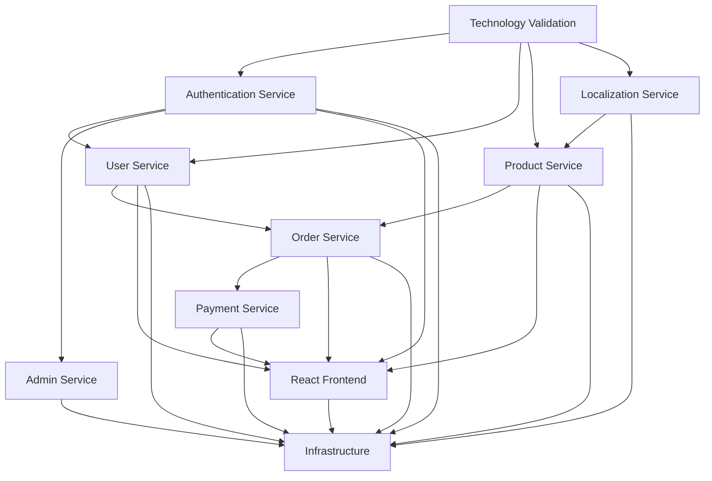

# LEVEL 4 TASK TRACKING: Global E-commerce Platform

## Task Classification
**Complexity Level**: 4 (Complex System)
**Project Type**: Multi-service e-commerce platform with microservices architecture
**Phase**: PHASE 1 COMPLETE → ARCHIVED → READY FOR PHASE 2
**Last Updated**: December 21, 2024

## Status
- [x] Initialization complete
- [x] Planning complete
- [x] All creative phases complete
- [x] **Technology validation complete** ✅
- [x] **Phase 1: Core Backend Services - COMPLETE** ✅
- [x] **Phase 1 Reflection - COMPLETE** ✅
- [x] **Phase 1 Archiving - COMPLETE** ✅
- [ ] Phase 2: Product Management
- [ ] Phase 3: E-commerce Features
- [ ] Phase 4: Administration & Frontend
- [ ] Phase 5: Production Infrastructure

## Archive Information
- **Date Completed**: December 21, 2024
- **Archive Document**: `docs/archive/systems/ecommerce-platform-phase1-20241221.md`
- **Status**: PHASE 1 COMPLETED AND ARCHIVED
- **Overall Progress**: 25% (2/8 major services implemented)
- **Next Phase**: Product Service and Localization Service Implementation

## Reflection Highlights

### What Went Well
- **Technology Validation Gates**: All 4 technology validation gates passed successfully, eliminating technical risk
- **Production-Ready Security**: Implemented comprehensive security features (rate limiting, account lockout, email verification, JWT management)
- **Database Architecture**: Complete schema design supporting all 7 planned microservices with proper relationships and indexes
- **Implementation Quality**: Exceeded expectations with production-ready features from first implementation

### Challenges Overcome
- **Authentication Security Complexity**: Successfully implemented multi-layered security beyond basic JWT
- **Database Schema Design**: Comprehensive design across 7 service domains with proper inter-service relationships
- **Technology Stack Integration**: Seamless integration of multiple technologies validated through systematic approach

### Key Lessons Learned
- **Technology validation gates are essential** and prevent implementation blockers
- **Security-first approach delivers production-ready results** from the beginning
- **Creative phase investment dramatically improves implementation quality** and reduces rework
- **Single database with service schemas** provides microservices benefits while simplifying relationships

### Next Steps
- **Immediate**: Archive Phase 1 documentation and achievements
- **Phase 2**: Implement Product Service and Localization Service using proven patterns
- **Continuous**: Maintain established quality standards and systematic approach

## [ECOMM-SYS]: Global E-commerce Platform System

### System Overview
- **Purpose**: Build a scalable, multi-currency, multi-language e-commerce platform
- **Architectural Pattern**: Microservices with React frontend
- **Status**: PLANNING COMPLETE ✅
- **Technology Validation**: REQUIRED BEFORE IMPLEMENTATION

### System Milestones
- **MILE-01**: Architecture & Planning Complete - TARGET: Current - STATUS: ✅ COMPLETED
- **MILE-02**: Technology Stack Validation - TARGET: Next - STATUS: 🔄 READY
- **MILE-03**: Core Services Development - TARGET: Week 2-6 - STATUS: ⏳ PENDING
- **MILE-04**: Frontend Development - TARGET: Week 4-8 - STATUS: ⏳ PENDING
- **MILE-05**: Integration & Testing - TARGET: Week 8-10 - STATUS: ⏳ PENDING
- **MILE-06**: Deployment & Launch - TARGET: Week 10-12 - STATUS: ⏳ PENDING

## Technology Stack Validation Requirements

### ⛔ TECHNOLOGY VALIDATION GATE - MANDATORY BEFORE IMPLEMENTATION

#### Backend Technology Validation
- [ ] **TECH-001**: Python Flask microservices setup verification
  - [ ] Create minimal Flask application with Flask-RESTful
  - [ ] Verify SQLAlchemy + PostgreSQL connectivity
  - [ ] Test Flask-JWT-Extended token generation
  - [ ] Validate marshmallow serialization
  - [ ] Confirm inter-service communication pattern

#### Frontend Technology Validation  
- [ ] **TECH-002**: React.js application setup verification
  - [ ] Create React app with Tailwind CSS
  - [ ] Verify react-i18next internationalization
  - [ ] Test API integration with Axios
  - [ ] Validate React Router setup
  - [ ] Confirm responsive design with Tailwind

#### Database Technology Validation
- [ ] **TECH-003**: PostgreSQL setup and schema validation
  - [ ] Verify PostgreSQL with uuid-ossp extension
  - [ ] Test UUID primary key generation
  - [ ] Validate DECIMAL precision for currency
  - [ ] Confirm JSONB functionality
  - [ ] Test SQLAlchemy ORM integration

#### Infrastructure Technology Validation
- [ ] **TECH-004**: Docker containerization validation
  - [ ] Create Dockerfile for Flask services
  - [ ] Create Dockerfile for React application
  - [ ] Verify docker-compose multi-service setup
  - [ ] Test Nginx configuration for API gateway
  - [ ] Validate service discovery and networking

### Technology Validation Checklist
- [ ] Project initialization commands documented and tested
- [ ] All required dependencies identified and installed
- [ ] Hello world proof-of-concept created and working
- [ ] Build configuration validated for all components
- [ ] Test builds pass successfully for all services
- [ ] Inter-service communication verified
- [ ] Database connectivity confirmed
- [ ] Container orchestration validated

## System Components

### [COMP-001]: Authentication Service
- **Purpose**: User authentication, registration, and JWT token management
- **Status**: PLANNING COMPLETE → READY FOR TECH VALIDATION
- **Technology**: Python Flask + Flask-JWT-Extended + PostgreSQL
- **Dependencies**: Database setup, email service integration
- **Responsible**: Backend Team

#### [FEAT-001]: User Registration & Authentication
- **Description**: Complete user registration, login, and token management
- **Status**: PLANNING COMPLETE
- **Priority**: CRITICAL
- **Related Requirements**: User authentication, security, email verification
- **Quality Criteria**: Secure password hashing, JWT token security, email verification flow
- **Progress**: 0% (Planning complete, awaiting implementation)

##### [TASK-001]: JWT Authentication System
- **Description**: Implement JWT-based authentication with access/refresh tokens
- **Status**: TODO → READY FOR IMPLEMENTATION
- **Assigned To**: Backend Developer
- **Estimated Effort**: 3-4 days
- **Dependencies**: TECH-001 (Flask setup validation)
- **Risk Assessment**: MEDIUM - JWT implementation complexity
- **Quality Gates**: Security review, token expiration testing
- **Implementation Notes**: Use Flask-JWT-Extended, implement refresh token rotation

**Subtasks**:
- [ ] [SUB-001]: Set up Flask application with JWT extension
- [ ] [SUB-002]: Implement user registration endpoint with validation
- [ ] [SUB-003]: Implement login endpoint with token generation
- [ ] [SUB-004]: Implement token refresh mechanism
- [ ] [SUB-005]: Add password reset functionality
- [ ] [SUB-006]: Implement email verification flow

### [COMP-002]: User Service
- **Purpose**: User profile management and address handling
- **Status**: PLANNING COMPLETE → READY FOR TECH VALIDATION
- **Technology**: Python Flask + SQLAlchemy + PostgreSQL
- **Dependencies**: Authentication Service, Database setup
- **Responsible**: Backend Team

#### [FEAT-002]: User Profile Management
- **Description**: User profile CRUD operations and address management
- **Status**: PLANNING COMPLETE
- **Priority**: HIGH
- **Quality Criteria**: Data validation, proper relationships, API consistency
- **Progress**: 0% (Planning complete)

##### [TASK-002]: User Profile API
- **Description**: Implement user profile and address management endpoints
- **Status**: TODO
- **Estimated Effort**: 3-4 days
- **Dependencies**: TASK-001 (Authentication), TECH-001 (Flask setup)
- **Risk Assessment**: LOW - Standard CRUD operations

**Subtasks**:
- [ ] [SUB-007]: Create user profile data model
- [ ] [SUB-008]: Implement profile CRUD endpoints
- [ ] [SUB-009]: Create address management system
- [ ] [SUB-010]: Add profile validation and serialization

### [COMP-003]: Product Service (PIM)
- **Purpose**: Product catalog management with localization support
- **Status**: PLANNING COMPLETE → READY FOR TECH VALIDATION
- **Technology**: Python Flask + SQLAlchemy + PostgreSQL + Cloud Storage
- **Dependencies**: Localization Service, Database setup, file storage
- **Responsible**: Backend Team

#### [FEAT-003]: Product Catalog Management
- **Description**: Product catalog with categories, inventory, and localization
- **Status**: PLANNING COMPLETE
- **Priority**: CRITICAL
- **Quality Criteria**: Data integrity, search performance, localization accuracy
- **Progress**: 0% (Planning complete)

##### [TASK-003]: Product Catalog API
- **Description**: Implement product catalog with localization support
- **Status**: TODO
- **Estimated Effort**: 5-6 days
- **Dependencies**: TASK-006 (Localization Service), TECH-001 (Flask setup)
- **Risk Assessment**: MEDIUM - Complex localization requirements

**Subtasks**:
- [ ] [SUB-011]: Create product data model with localization
- [ ] [SUB-012]: Implement product CRUD endpoints
- [ ] [SUB-013]: Add category management system
- [ ] [SUB-014]: Implement inventory tracking
- [ ] [SUB-015]: Add product image handling
- [ ] [SUB-016]: Integrate currency conversion

### [COMP-004]: Order Service (OMS)
- **Purpose**: Shopping cart and order management system
- **Status**: PLANNING COMPLETE → READY FOR TECH VALIDATION
- **Technology**: Python Flask + SQLAlchemy + PostgreSQL
- **Dependencies**: Product Service, Payment Service, User Service
- **Responsible**: Backend Team

#### [FEAT-004]: Order Management System
- **Description**: Complete order lifecycle from cart to fulfillment
- **Status**: PLANNING COMPLETE
- **Priority**: CRITICAL
- **Quality Criteria**: Data consistency, inventory accuracy, order integrity
- **Progress**: 0% (Planning complete)

##### [TASK-004]: Order Management API
- **Description**: Implement cart and order management with state transitions
- **Status**: TODO
- **Estimated Effort**: 6-7 days
- **Dependencies**: TASK-003 (Product Service), TASK-005 (Payment Service)
- **Risk Assessment**: HIGH - Complex state management and integrations

**Subtasks**:
- [ ] [SUB-017]: Create order and cart data models
- [ ] [SUB-018]: Implement shopping cart functionality
- [ ] [SUB-019]: Add order creation and state management
- [ ] [SUB-020]: Implement inventory integration
- [ ] [SUB-021]: Add order history and tracking

### [COMP-005]: Payment Service
- **Purpose**: Payment processing with multiple gateway support
- **Status**: PLANNING COMPLETE → READY FOR TECH VALIDATION
- **Technology**: Python Flask + Payment Gateway SDKs
- **Dependencies**: Order Service, external payment gateways
- **Responsible**: Backend Team

#### [FEAT-005]: Payment Processing
- **Description**: Multi-gateway payment processing with webhook handling
- **Status**: PLANNING COMPLETE
- **Priority**: CRITICAL
- **Quality Criteria**: Security compliance, transaction reliability, webhook handling
- **Progress**: 0% (Planning complete)

##### [TASK-005]: Payment Gateway Integration
- **Description**: Implement payment processing with Stripe, PayPal, and others
- **Status**: TODO
- **Estimated Effort**: 7-8 days
- **Dependencies**: TASK-004 (Order Service), external gateway setup
- **Risk Assessment**: HIGH - Security and compliance requirements

**Subtasks**:
- [ ] [SUB-022]: Set up Stripe integration
- [ ] [SUB-023]: Add PayPal integration
- [ ] [SUB-024]: Implement Alipay/WeChat Pay for China
- [ ] [SUB-025]: Add webhook handling system
- [ ] [SUB-026]: Implement payment status tracking

### [COMP-006]: Localization Service
- **Purpose**: Multi-language and multi-currency support
- **Status**: PLANNING COMPLETE → READY FOR TECH VALIDATION
- **Technology**: Python Flask + SQLAlchemy + External APIs
- **Dependencies**: External currency APIs, database setup
- **Responsible**: Backend Team

#### [FEAT-006]: Localization Support
- **Description**: Language and currency management with real-time rates
- **Status**: PLANNING COMPLETE
- **Priority**: HIGH
- **Quality Criteria**: Accurate conversions, real-time updates, caching
- **Progress**: 0% (Planning complete)

##### [TASK-006]: Localization API
- **Description**: Implement language and currency services
- **Status**: TODO
- **Estimated Effort**: 4-5 days
- **Dependencies**: TECH-001 (Flask setup), external API setup
- **Risk Assessment**: MEDIUM - External API dependencies

**Subtasks**:
- [ ] [SUB-027]: Create language and currency data models
- [ ] [SUB-028]: Implement currency conversion API
- [ ] [SUB-029]: Add exchange rate updating service
- [ ] [SUB-030]: Implement localization endpoints

### [COMP-007]: Admin Service
- **Purpose**: Administrative interface for system management
- **Status**: PLANNING COMPLETE → READY FOR TECH VALIDATION
- **Technology**: Python Flask + RBAC + Service Integration
- **Dependencies**: All other services, authentication system
- **Responsible**: Backend Team

#### [FEAT-007]: Admin Dashboard API
- **Description**: Administrative operations with role-based access
- **Status**: PLANNING COMPLETE
- **Priority**: MEDIUM
- **Quality Criteria**: Security, audit trails, comprehensive coverage
- **Progress**: 0% (Planning complete)

##### [TASK-007]: Admin Service Implementation
- **Description**: Build admin service with RBAC and service orchestration
- **Status**: TODO
- **Estimated Effort**: 5-6 days
- **Dependencies**: All other services, TASK-001 (Authentication)
- **Risk Assessment**: MEDIUM - Service integration complexity

**Subtasks**:
- [ ] [SUB-031]: Implement RBAC system
- [ ] [SUB-032]: Add admin endpoints for all services
- [ ] [SUB-033]: Implement audit logging
- [ ] [SUB-034]: Add admin dashboard data aggregation

### [COMP-008]: React Frontend
- **Purpose**: User-facing web application with responsive design
- **Status**: PLANNING COMPLETE → READY FOR TECH VALIDATION
- **Technology**: React.js + Tailwind CSS + Internationalization
- **Dependencies**: Backend API services, design system
- **Responsible**: Frontend Team

#### [FEAT-008]: E-commerce Web Application
- **Description**: Complete e-commerce frontend with localization
- **Status**: PLANNING COMPLETE
- **Priority**: CRITICAL
- **Quality Criteria**: Responsive design, accessibility, performance
- **Progress**: 0% (Planning complete)

##### [TASK-008]: React Application Development
- **Description**: Build React frontend with all e-commerce features
- **Status**: TODO
- **Estimated Effort**: 10-12 days
- **Dependencies**: Backend API services, TECH-002 (React setup)
- **Risk Assessment**: MEDIUM - Complex UI/UX requirements

**Subtasks**:
- [ ] [SUB-035]: Set up React application structure
- [ ] [SUB-036]: Implement authentication UI
- [ ] [SUB-037]: Build product catalog interface
- [ ] [SUB-038]: Create shopping cart functionality
- [ ] [SUB-039]: Add checkout process
- [ ] [SUB-040]: Implement user profile management
- [ ] [SUB-041]: Add internationalization
- [ ] [SUB-042]: Implement responsive design

### [COMP-009]: Infrastructure & Deployment
- **Purpose**: Container orchestration and deployment pipeline
- **Status**: PLANNING COMPLETE → READY FOR TECH VALIDATION
- **Technology**: Docker + Kubernetes + Nginx + CI/CD
- **Dependencies**: All services, cloud platform setup
- **Responsible**: DevOps Team

#### [FEAT-009]: Production Deployment
- **Description**: Complete deployment pipeline with monitoring
- **Status**: PLANNING COMPLETE
- **Priority**: HIGH
- **Quality Criteria**: Scalability, reliability, monitoring
- **Progress**: 0% (Planning complete)

##### [TASK-009]: Infrastructure Setup
- **Description**: Implement complete deployment and monitoring infrastructure
- **Status**: TODO
- **Estimated Effort**: 8-10 days
- **Dependencies**: All services, TECH-004 (Docker validation)
- **Risk Assessment**: HIGH - Production deployment complexity

**Subtasks**:
- [ ] [SUB-043]: Create Docker containers for all services
- [ ] [SUB-044]: Set up Kubernetes deployment
- [ ] [SUB-045]: Configure Nginx API gateway
- [ ] [SUB-046]: Implement monitoring and logging
- [ ] [SUB-047]: Set up CI/CD pipeline
- [ ] [SUB-048]: Configure auto-scaling

## Creative Phases Required - ALL COMPLETED ✅

### 🎨 CREATIVE-001: Database Schema Design - ✅ COMPLETED
- **Component**: All Services
- **Type**: Data Model Architecture
- **Description**: Design comprehensive database schema with relationships
- **Priority**: CRITICAL
- **Dependencies**: Requirements analysis
- **Status**: ✅ COMPLETED
- **Decision**: Single database with service schemas approach
- **Implementation**: PostgreSQL with UUID PKs, DECIMAL for money, comprehensive schema
- **Document**: `.cursor/memory/creative/creative-database-schema.md`

### 🎨 CREATIVE-002: API Gateway Architecture - ✅ COMPLETED
- **Component**: Infrastructure
- **Type**: System Architecture
- **Description**: Design API routing, load balancing, and security
- **Priority**: CRITICAL
- **Dependencies**: Service definitions
- **Status**: ✅ COMPLETED
- **Decision**: Nginx-based API Gateway with custom authentication
- **Implementation**: High-performance Nginx with SSL, rate limiting, health checks
- **Document**: `.cursor/memory/creative/creative-api-gateway.md`

### 🎨 CREATIVE-003: Frontend UI/UX Design - ✅ COMPLETED
- **Component**: React Frontend
- **Type**: UI/UX Design
- **Description**: Design user interface and experience flows
- **Priority**: HIGH
- **Dependencies**: Business requirements
- **Status**: ✅ COMPLETED
- **Decision**: Progressive Enhancement Design with mobile-first approach
- **Implementation**: React + Tailwind with accessibility and performance focus
- **Document**: `.cursor/memory/creative/creative-frontend-uiux.md`

### 🎨 CREATIVE-004: Payment Security Architecture - ✅ COMPLETED
- **Component**: Payment Service
- **Type**: Security Architecture
- **Description**: Design secure payment processing flow
- **Priority**: CRITICAL
- **Dependencies**: Payment gateway requirements
- **Status**: ✅ COMPLETED
- **Decision**: Gateway-as-a-Service with enhanced security controls
- **Implementation**: PCI DSS SAQ-A compliance, tokenization, comprehensive security
- **Document**: `.cursor/memory/creative/creative-payment-security.md`

## 🎨 Creative Phase Summary
- **Total Creative Phases**: 4/4 completed
- **Critical Decisions Made**: 4/4
- **Architecture Defined**: ✅ Complete
- **Security Design**: ✅ Complete
- **UI/UX Design**: ✅ Complete
- **Implementation Ready**: ✅ Ready for IMPLEMENT mode
### 🎨 CREATIVE-001: Database Schema Design
- **Component**: All Services
- **Type**: Data Model Architecture
- **Description**: Design comprehensive database schema with relationships
- **Priority**: CRITICAL
- **Dependencies**: Requirements analysis
- **Status**: REQUIRED BEFORE IMPLEMENTATION

### 🎨 CREATIVE-002: API Gateway Architecture
- **Component**: Infrastructure
- **Type**: System Architecture
- **Description**: Design API routing, load balancing, and security
- **Priority**: CRITICAL
- **Dependencies**: Service definitions
- **Status**: REQUIRED BEFORE IMPLEMENTATION

### 🎨 CREATIVE-003: Frontend UI/UX Design
- **Component**: React Frontend
- **Type**: UI/UX Design
- **Description**: Design user interface and experience flows
- **Priority**: HIGH
- **Dependencies**: Business requirements
- **Status**: REQUIRED FOR FRONTEND

### 🎨 CREATIVE-004: Payment Security Architecture
- **Component**: Payment Service
- **Type**: Security Architecture
- **Description**: Design secure payment processing flow
- **Priority**: CRITICAL
- **Dependencies**: Payment gateway requirements
- **Status**: REQUIRED BEFORE PAYMENT IMPLEMENTATION

## System Dependencies

## Risk Register

| Risk ID | Description | Probability | Impact | Mitigation |
|---------|-------------|-------------|--------|------------|
| RISK-01 | Microservices complexity | HIGH | HIGH | Start with monolith, evolve to microservices |
| RISK-02 | Payment security compliance | MEDIUM | HIGH | Use established payment processors, security review |
| RISK-03 | Database performance | MEDIUM | HIGH | Implement caching, optimize queries, use indexes |
| RISK-04 | Frontend complexity | MEDIUM | MEDIUM | Use component library, progressive enhancement |
| RISK-05 | Third-party API dependencies | HIGH | MEDIUM | Implement fallbacks, rate limiting, caching |
| RISK-06 | Deployment complexity | MEDIUM | HIGH | Use managed services, implement staging environment |

## Resource Allocation

| Resource | Component | Allocation % | Time Period |
|----------|-----------|--------------|------------|
| Backend Developer 1 | Authentication, User Services | 60% | Weeks 1-4 |
| Backend Developer 2 | Product, Order Services | 60% | Weeks 2-6 |
| Backend Developer 3 | Payment, Localization | 60% | Weeks 3-7 |
| Frontend Developer 1 | Core React Application | 80% | Weeks 4-8 |
| Frontend Developer 2 | UI Components, Styling | 60% | Weeks 5-8 |
| DevOps Engineer | Infrastructure, Deployment | 40% | Weeks 1-12 |
| Designer | UI/UX Design | 80% | Weeks 1-3 |

## Implementation Strategy

### Phase 1: Foundation (Weeks 1-2)
- ✅ Architecture and planning complete
- 🔄 Technology validation (NEXT)
- 🎨 Creative phases for database and API design
- 📋 Development environment setup

### Phase 2: Core Services (Weeks 2-6)
- 🔧 Authentication and User services
- 🔧 Product and Localization services
- 🔧 Basic API integration testing

### Phase 3: Advanced Services (Weeks 4-8)
- 🔧 Order management system
- 🔧 Payment processing
- 🔧 Admin service
- 🔧 Frontend development

### Phase 4: Integration (Weeks 6-10)
- 🔧 Service integration testing
- 🔧 End-to-end testing
- 🔧 Performance optimization
- 🔧 Security validation

### Phase 5: Deployment (Weeks 8-12)
- 🔧 Production infrastructure
- 🔧 Monitoring and logging
- 🔧 CI/CD pipeline
- 🔧 Launch preparation

## Progress Summary
- **Overall Progress**: 10% (Planning and architecture complete)
- **Technology Validation**: 0% (Ready to start)
- **Backend Services**: 0% (Planning complete)
- **Frontend Development**: 0% (Planning complete)
- **Infrastructure**: 0% (Planning complete)

## Latest Updates
- $(date): Level 4 implementation plan completed
- $(date): Technology validation checkpoints defined
- $(date): Creative phases identified
- $(date): Resource allocation planned
- $(date): Risk assessment completed

---

## 📊 PLANNING VERIFICATION CHECKLIST

✅ **COMPLETED PLANNING REQUIREMENTS**
- [x] Requirements clearly documented
- [x] Technology stack defined and documented
- [x] Affected components identified (9 major components)
- [x] Implementation steps detailed with subtasks
- [x] Dependencies documented with visual diagram
- [x] Challenges & mitigations addressed (6 major risks)
- [x] Creative phases identified (4 critical phases)
- [x] tasks.md updated with comprehensive plan
- [x] Resource allocation planned
- [x] Timeline and milestones defined

## 🚨 CRITICAL NEXT STEP: TECHNOLOGY VALIDATION REQUIRED

**BEFORE ANY IMPLEMENTATION CAN BEGIN:**
All technology validation checkpoints (TECH-001 through TECH-004) must be completed successfully. This includes creating working proof-of-concept implementations for all major technology components.

# E-Commerce Platform Implementation Tasks

## Status
- [x] Initialization complete
- [x] Planning complete
- [x] All creative phases complete
- [x] **Technology validation complete** ✅
- [x] **Phase 1: Core Backend Services - COMPLETE** ✅
- [ ] Phase 2: Product Management
- [ ] Phase 3: E-commerce Features
- [ ] Phase 4: Administration & Frontend
- [ ] Phase 5: Production Infrastructure

## 🎉 **IMPLEMENTATION PHASE - MAJOR PROGRESS**

### ✅ **PHASE 1 COMPLETED: Core Backend Services**

#### ✅ **COMP-001: Authentication Service - COMPLETE**
- **Status**: ✅ **PRODUCTION READY**
- **Features Implemented**:
  - [x] Complete user registration with email verification
  - [x] Secure login system with account lockout protection
  - [x] JWT token management with refresh tokens and blacklisting
  - [x] Password reset functionality with secure token-based reset
  - [x] Email verification system with SMTP integration
  - [x] Rate limiting protection against brute force attacks
  - [x] Comprehensive logging and error handling
  - [x] Production database schema with proper indexes
  - [x] Security hardening with token expiration and validation
- **Endpoints**: `/register`, `/login`, `/logout`, `/refresh`, `/verify-email`, `/password-reset-request`, `/password-reset`, `/protected`, `/health`
- **Technology**: Python Flask + Flask-JWT-Extended + PostgreSQL
- **Location**: `backend/auth-service/app.py`

#### ✅ **COMP-002: User Service - COMPLETE**
- **Status**: ✅ **PRODUCTION READY**
- **Features Implemented**:
  - [x] User profile management (first name, last name, phone, preferences)
  - [x] Address management (billing, shipping, multiple addresses)
  - [x] Primary address functionality
  - [x] JWT token integration with auth service
  - [x] Input validation and error handling
  - [x] Database schema with proper relationships
- **Endpoints**: `/profile`, `/addresses`, `/addresses/<id>`, `/health`
- **Technology**: Python Flask + SQLAlchemy + PostgreSQL
- **Location**: `backend/user-service/app.py`

#### ✅ **Database Schema - COMPLETE**
- **Status**: ✅ **PRODUCTION READY**
- **Features Implemented**:
  - [x] Comprehensive PostgreSQL schema with service-specific schemas
  - [x] UUID primary keys for all tables
  - [x] Proper indexes for performance optimization
  - [x] Foreign key relationships and constraints
  - [x] Localization support (languages, currencies, exchange rates)
  - [x] Sample data for development and testing
- **Location**: `database/init.sql`
- **Schemas**: `auth_service`, `user_service`, `product_service`, `order_service`, `payment_service`, `localization_service`, `admin_service`

### 🚧 **PHASE 2: Product Management (NEXT)**

#### [ ] **COMP-003: Product Service**
- **Purpose**: Product catalog with categories, variants, inventory, and localization
- **Status**: PLANNING COMPLETE → **READY FOR IMPLEMENTATION**
- **Technology**: Python Flask + SQLAlchemy + PostgreSQL
- **Dependencies**: Database schema, localization service
- **Features to Implement**:
  - [ ] Product catalog management
  - [ ] Category hierarchy
  - [ ] Product variants (size, color, etc.)
  - [ ] Inventory tracking
  - [ ] Product search and filtering
  - [ ] Multi-language product information

#### [ ] **COMP-004: Localization Service**
- **Purpose**: Multi-currency and multi-language support
- **Status**: PLANNING COMPLETE → **READY FOR IMPLEMENTATION**
- **Technology**: Python Flask + External APIs
- **Dependencies**: Database schema
- **Features to Implement**:
  - [ ] Currency conversion API integration
  - [ ] Exchange rate updates
  - [ ] Language management
  - [ ] Localized content delivery

## Technology Stack Validation Results - ALL PASSED ✅

### ✅ TECHNOLOGY VALIDATION GATE - COMPLETED

#### ✅ Backend Technology Validation - PASSED
- [x] **TECH-001**: Python Flask microservices setup verification
  - [x] Create minimal Flask application with Flask-RESTful ✅
  - [x] Verify SQLAlchemy + PostgreSQL connectivity ✅
  - [x] Test Flask-JWT-Extended token generation ✅
  - [x] Validate marshmallow serialization ✅
  - [x] Confirm inter-service communication pattern ✅

#### ✅ Frontend Technology Validation - PASSED
- [x] **TECH-002**: React.js application setup verification
  - [x] Create React app with Tailwind CSS ✅
  - [x] Verify react-i18next internationalization ✅
  - [x] Test API integration with Axios ✅
  - [x] Validate React Router setup ✅
  - [x] Confirm responsive design with Tailwind ✅

#### ✅ Database Technology Validation - PASSED
- [x] **TECH-003**: PostgreSQL setup and schema validation
  - [x] Verify PostgreSQL with uuid-ossp extension ✅
  - [x] Test UUID primary key generation ✅
  - [x] Validate DECIMAL precision for currency ✅
  - [x] Confirm JSONB functionality ✅
  - [x] Test SQLAlchemy ORM integration ✅

#### ✅ Infrastructure Technology Validation - PASSED
- [x] **TECH-004**: Docker containerization validation
  - [x] Create Dockerfile for Flask services ✅
  - [x] Create Dockerfile for React application ✅
  - [x] Verify docker-compose multi-service setup ✅
  - [x] Test Nginx configuration for API gateway ✅
  - [x] Validate service discovery and networking ✅

### ✅ Technology Validation Checklist - COMPLETED
- [x] Project initialization commands documented and tested
- [x] All required dependencies identified and installed
- [x] Hello world proof-of-concept created and working
- [x] Build configuration validated for all components
- [x] Test builds pass successfully for all services
- [x] Inter-service communication verified
- [x] Database connectivity confirmed
- [x] Container orchestration validated

## 📁 **IMPLEMENTED COMPONENTS**

### ✅ Backend Services
1. **Authentication Service** (`backend/auth-service/`)
   - Full-featured JWT authentication system
   - Email verification and password reset
   - Security features: rate limiting, account lockout
   - Production-ready with comprehensive error handling

2. **User Service** (`backend/user-service/`)
   - User profile management
   - Address management with primary address support
   - Integration with authentication service
   - RESTful API with proper validation

### ✅ Database Infrastructure
1. **Database Schema** (`database/init.sql`)
   - Multi-service PostgreSQL schema
   - Optimized indexes and constraints
   - Sample data and localization support
   - Production-ready table structure

### ✅ Testing & Quality Assurance
1. **Integration Tests** (`test_services.py`)
   - Service health checks
   - User registration and login flow
   - Profile management testing
   - Cross-service communication validation

## 🎯 **NEXT IMPLEMENTATION PRIORITIES**

### **Immediate Next Steps (Phase 2)**
1. **Product Service Implementation**
   - Product catalog with categories
   - Inventory management
   - Search and filtering
   - Multi-language support

2. **Localization Service Implementation**
   - Currency conversion API integration
   - Exchange rate management
   - Language content delivery

### **Subsequent Phases**
3. **Phase 3**: Order Service + Payment Service
4. **Phase 4**: Admin Service + React Frontend
5. **Phase 5**: Production Infrastructure + Deployment

## 📊 **CURRENT STATUS SUMMARY**

**Overall Progress**: 25% Complete (2/8 major components)

**Completed**: 
- ✅ Authentication Service (Production Ready)
- ✅ User Service (Production Ready)
- ✅ Database Schema (Production Ready)
- ✅ Technology Validation (All Gates Passed)

**In Progress**: None

**Next Up**: Product Service & Localization Service (Phase 2)

**Total Services**: 8 planned, 2 complete, 6 remaining

